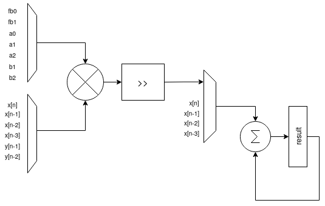
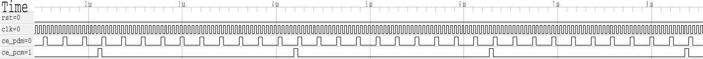

# SSCS-Sonar On Chip
## General information
The project implements a digital system for signal processing in order to capture and process acoustics signals from 36 MEMS microphones with extended frequency range up to 85 kHz (low ultrasonic band). The system itself is a part of the Caravel harness and can be configured and managed from the Caravel using Wishbone bus.\
The principle of operation of the system is the following:\
Each, pulse density modulated (PDM), microphone signal is processed individually using separate channel, which demodulates PDM data recovering PCM samples, filters out audible frequencies, detects the envelope and compare its value to a configurable threshold. The result of the comparison triggers an interrupt and stops a free running timer configured in a capture mode. The timers are cleared synchronously on all channels and the value of the each timer can be read by the RISC-V processor. The captured values of the 36 timers can be post processed on the RISC-V processor and the direction of arrival of the wavefront can b estimated.  

## Datapath description
Each channel consists of PDM demodulator, which process the incoming signal. The datapath has some configuration options based on control register:
* control[0] bit if set to logic 1 it permits to use control[1] bit as a WE signal for the PCM datapath, if set to 0 (default) WE is generated automatically.
* control[2] bit if set to logic 1 it bypasses the IIR filter, default value is 0,
* control[3] bit if set to logic 1 permits to load the PCM datapath with a value stored in pcm_load register (default 0),

### PDM demodulation 
Demodulation results
### DSP 
In order to reduce the footprint of the channel the filters were implemented using only one adder and one multiplier. It is allowed due to the fact that the PCM frequency is much more lower (50 times) than the clock frequency of the whole system. The FIR, IIR and Moaving Average (MA) filters are calculated in a subsequent sycles sharing same multiplier and adder. It was implemented using a FSM in the file src/FILTERS.v

## Top level module
The top level module consists of 36 channels, status register, prescaler register, three clock diviers, which generate :
* a 4.8 MHz clock signal **mclk** for the external microphones (50 % duty cycle),
* a 4.8 MHz clock enable signal **ce_pdm** for PDM demodulator,
* a 480 kHz (configurable) clock enable signal **ce_pcm** for the PCM datapath. 

The top level implements a Wishbone slave, which multiplexes all channels using reduced data interface (16 bits) and address bus (4 bits). 
The multipexation scheme is based on address decoding and selection of a current module using One-Hot valid signal. 
The status  register together with the most significant byte of the prescaler register hold the values of the comparison of all 36 channels. Those values are OR-ed  and passed to the IRQ[0] signal indicating detection of the signal of any microphone. The IRQ[1] and IRQ[2] are routed to the compare output of the most extreeme channels, what will permit not only detect the signal but also to determine the direction of arrival in a case of a linear array. The prescaler register set up the WE signal frequency for the PCM datapath, thus, various decimation values can be used in the datapath. The default value is 49, what corresponds to the decimation factor of 10. 

### Clock divider
mic_clk \
ce_pdm \
ce_pcm \

### Channel multiplexing
WB Bus reduction

## Register map
Memory map of the system starts at address 0x3000 0000 (Wishbone Slave address space):
Register     | Value
------------ | -------------
Status               | 0x3000 0000
Prescaler            | 0x3000 0004

Each channel has 13 registers. The register mapping of the first channel is shown below:

Register     | Value
------------ | -------------
Control register  | 0x3000 0008
IIR  a0 coeff     | 0x3000 000C
IIR  a1 coeff     | 0x3000 0010
IIR  a2 coeff     | 0x3000 0014
IIR  b1 coeff     | 0x3000 0018
IIR  b2 coeff     | 0x3000 001C
Amplification     | 0x3000 0020
Threshold         | 0x3000 0024
Timer             | 0x3000 0028
PCM sample        | 0x3000 002C
PCM Load          | 0x3000 0030
FIR  b0 coeff     | 0x3000 0034
FIR  b1 coeff     | 0x3000 0038

All channels have the same register map starting from control register. The control register address of a n-th channel  can be calculated as follows: 

## Pending Issues

* Static Timing Analysis - Hold violations, multicycle paths
* Antenna violations.
* Functional simulation at the gate level in hierarquical design. 
 

## Folder description

config.tcl - main script for the OpenLane flow

macro\ - holds two folders, which configure the macro hardening at the: (1) top level, (2) user_project_wrapper level \
src\ - holds files for  one channel of the SonarOnChip\
rtl\ - holds verilog files for functional simulation at the level of the whole Caravel Harness\
scripts\ - custom scripts for yosys and OpenSTA\
results\ - results generated by custom scripts\
sim\ - holds simulation testbench uesd together with rtl\ folder\

This repository should be placed in the design/ folder of the OpenLane. \
You should export the following variables in your .profile\
export CARAVEL_DIR="path_to_your_caravel/caravel"\
export RV32_GCC="/path_to/riscv32/bin"\
export PDK_ROOT="/path_to_PDK/pdks"\
